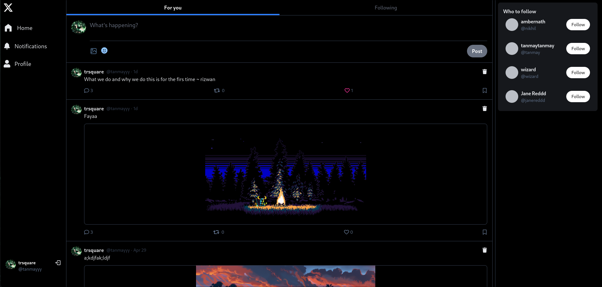

# X Clone (Learning Fullstack)

A simple clone of [x.com](https://x.com) built to learn fullstack development using Node.js and React.

## Preview

### View it [here](https://x-clone-3y95.onrender.com/) 

### Backend
- Node.js
- Express.js
- MongoDB 
- Middleware for request handling

### Frontend
- Vite
- React
- Tailwind CSS 
