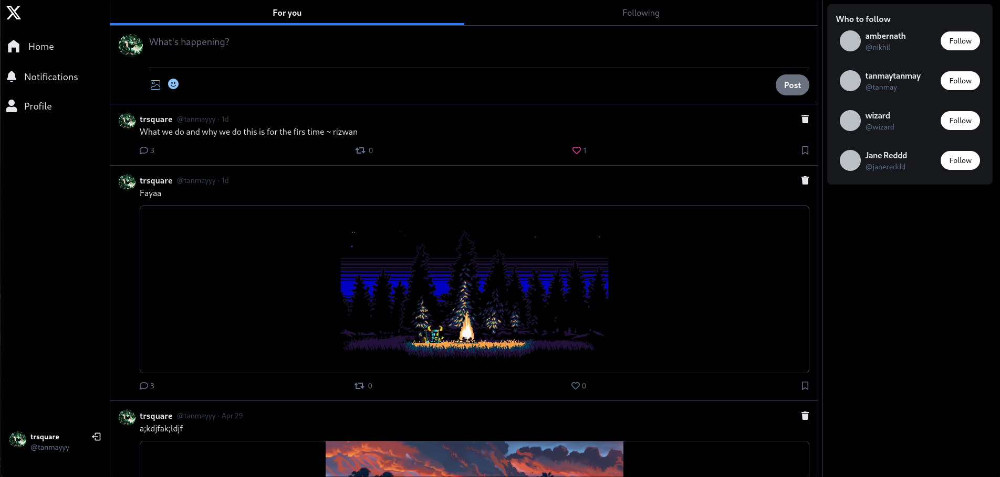

# X-Clone — Full-Stack Twitter/X Clone

> A full-stack social media application replicating core X (Twitter) functionality — built with a **Node.js/Express REST API backend** and a **React SPA frontend**, deployed on Render with Cloudinary for media.

## Preview



### View it [here](https://x-clone-3y95.onrender.com/)

## Project Description

A full-featured social media application that lets users create text and image posts, like, comment, follow other users, and receive notifications — mirroring the core experience of X (Twitter).

## Features

- User registration, login, logout, and session persistence with JWT + httpOnly cookies
- Create, view, and delete text and image posts
- Like/unlike posts with real-time optimistic UI updates
- Comment on posts via a modal interface
- Follow/unfollow users with automatic notification alerts
- Personal profile with cover photo, avatar, bio, personal link, and joined date
- Notifications page for likes and follows, with delete-all option
- Suggested users sidebar ("Who to follow")
- For You / Following feed tabs, plus per-user Posts and Likes feeds

## Tech Stack

### Backend
- **Node.js** & **Express.js** — RESTful API with modular controller-routes structure
- **MongoDB** & **Mongoose** — schemas for Users, Posts, and Notifications with population for relational queries
- **JWT** with httpOnly cookies (15-day expiry) for authentication
- **bcryptjs** for password hashing (10 salt rounds)
- **Cloudinary** for image upload, storage, and removal
- **cookie-parser**, CORS, and dotenv for environment configuration

### Frontend
- **React 19** SPA with **Vite** bundler and client-side routing (React Router 7)
- **TanStack React Query** for server state management — fetching, caching, and cache invalidation
- Optimistic UI updates for likes with automatic rollback on error
- **Tailwind CSS 4** + **DaisyUI** for a dark, responsive X-like theme
- **react-hot-toast** for notifications, **react-icons** for icons
- Loading skeletons, relative time formatting, and FileReader-based image previews

## Project Structure

```
X-Clone/
├── backend/               # Node.js + Express REST API
│   ├── controllers/       # auth, posts, users, notifications logic
│   ├── models/            # User, Post, Notification Mongoose schemas
│   ├── routes/            # API route definitions
│   ├── middleware/        # protectRoute (JWT verification)
│   ├── db/                # connectMongoDB
│   ├── lib/               # utility helpers (token generation)
│   └── server.js          # Express app entry point
└── frontend/              # React + Vite SPA
    └── src/
        ├── components/    # Posts, Post, Sidebar, RightPanel, skeletons
        ├── pages/         # auth, home, profile, notification pages
        ├── hooks/         # useFollow
        └── utils/         # date formatting
```

## Getting Started

### Prerequisites
- Node.js (v18+)
- MongoDB (local instance or Atlas cluster)
- A Cloudinary account

### Installation

1. Clone the repository
2. Install backend dependencies
   ```bash
   cd backend
   npm install
   ```
3. Set up environment variables (see [Environment Variables](#environment-variables))
4. Start the backend server
   ```bash
   npm run dev
   ```
5. In a separate terminal, install and start the frontend
   ```bash
   cd frontend
   npm install
   npm run dev
   ```

### Environment Variables

Copy `backend/.env.example` to `backend/.env` and fill in your own values:

```bash
cp backend/.env.example backend/.env
```

| Variable | Description |
| --- | --- |
| `PORT` | Server port (default: `5000`) |
| `NODE_ENV` | `development` or `production` |
| `MONGO_URI` | MongoDB connection string |
| `JWT_SECRET` | Secret used to sign JWTs |
| `CLOUDINARY_CLOUD_NAME` | Cloudinary cloud name |
| `CLOUDINARY_API_KEY` | Cloudinary API key |
| `CLOUDINARY_API_SECRET` | Cloudinary API secret |

### Running in Production

```bash
cd backend
npm start
```

In production (`NODE_ENV=production`), Express serves the prebuilt frontend from `frontend/dist`:
```bash
cd frontend
npm run build
```